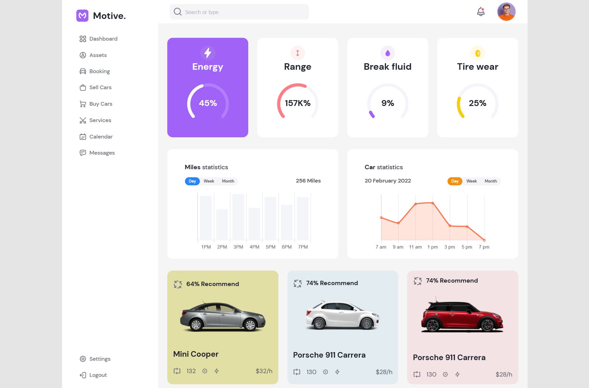
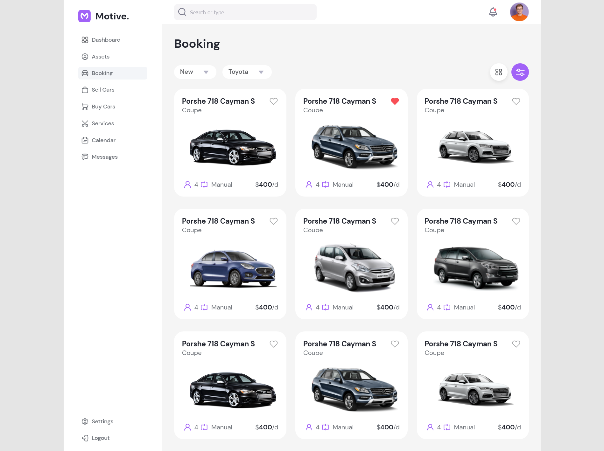

# Motiv - A business dashboard

This is my attempt at implementing a ready dashboard design from figma.
It is also my first attempt working with chart.js.

## Table of contents

- [Overview](#overview)
  - [The challenge](#the-challenge)
  - [Screenshot](#screenshot)
- [My process](#my-process)
  - [Built with](#built-with)
  - [Continued development](#continued-development)

## Overview

### The challenge

Users should be able to:

- Navigate between the two pages, dashboard and booking
- Refresh without going back to the homepage.
- Interact with the statistics shown in the home page.

### Screenshots

#### Dashboard page

#### Booking page

## My process

### Built with

- Semantic HTML5 markup
- CSS custom properties
- Flexbox
- React V18.2
- react-chartjs-2
- react-router-dom

### Continued development

- Make the pages responsive
- Add more pages
- Implement a dark mode
- Split the css into sections
- Better organize the code (make it more DRY)
